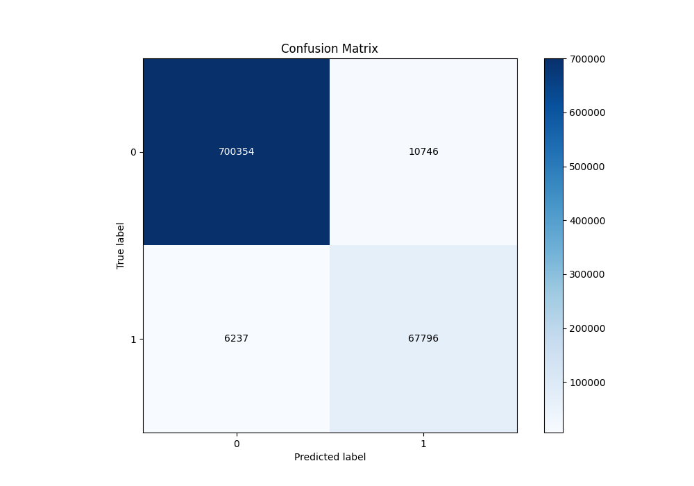
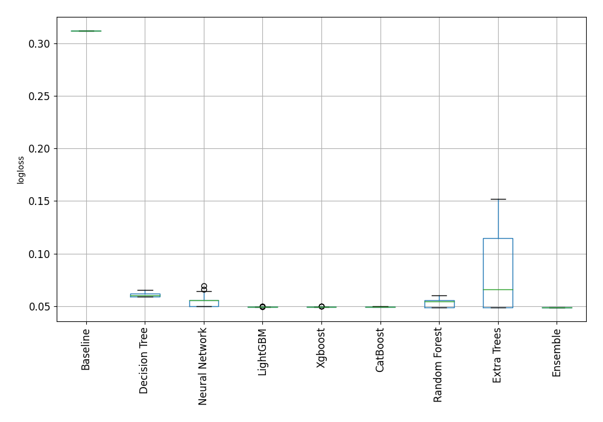
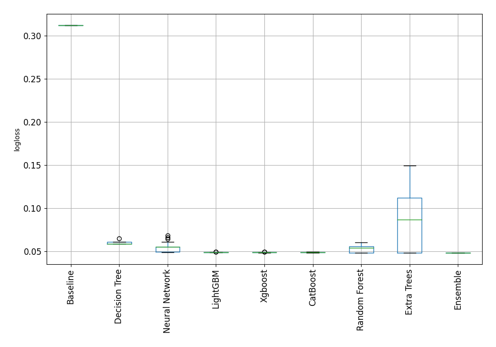

# Stacked-Ensemble GSTN Modeling and Classification
The given submission is by **Shreyasvi Natraj** for the GSTN Hackathon on Predictive Modeling and Classification.

**SHA256 Checksum: 0e28c59d2f2ee43ea6076b154bec03512bc0f5eb62c7217e17b3ef5a122bc162**

## Usage

### Training
In order to use the scripts for training and prediction, please follow the following steps:
- Install dependencies using `pip install -r requirements.txt`
- Download the dataset (in `.csv` format) and add the `target` variable column into the column with `input` data i.e. combine the two `.csv` files so that the target is the first column and the inputs are the following columns.
- Run training using `python train_automl.py`.
- **Optional:** In order to train over the dataset where training and validation set are combined, follow steps 2 and run `python train_automl_merge_data.py`.
- Once the model has been trained, you will obtain an `AutoML_<Run Number>` folder.

### Prediction
- Carry out prediction by changing the `trained_model_folder_path` in the `predict_automl.py` script as well as the CSV file to be used for prediction.
- Run prediction script using `python predict_automl.py`
The resultant accuracy over test data can be observed in the command prompt.

The pretrained models that were used in the training and prediction can be downloaded from [this link](). 

Make sure to extract the zip and place the two models `AutoML_small` (trained only over the training set) and `AutoML_full` (trained over the combined training and validation set) in the cloned folder and add the specific model you want to test in the `trained_model_folder_path` in `predict_automl.py` script.

## Results

Here, the model was trained by splitting the training set 5-fold and 10-fold. The balanced accuracy across all the cross-validated splits is described below.

### Ensemble structure (Only Training Set)
| Model                                     |   Weight |
|:------------------------------------------|---------:|
| 113_RandomForest_SelectedFeatures_Stacked |       54 |
| 114_RandomForest_Stacked                  |       12 |
| 115_ExtraTrees_SelectedFeatures_Stacked   |       14 |
| 117_ExtraTrees_Stacked                    |       29 |
| 22_LightGBM_KMeansFeatures                |       13 |
| 23_LightGBM_KMeansFeatures                |        1 |
| 25_LightGBM                               |       19 |
| 52_ExtraTrees_Stacked                     |       40 |
| Ensemble                                  |        1 |

#### Metric details
|           |     score |     threshold |
|:----------|----------:|--------------:|
| logloss   | 0.0487711 | nan           |
| auc       | 0.994939  | nan           |
| f1        | 0.890978  |   0.399357    |
| accuracy  | 0.978369  |   0.560246    |
| precision | 0.993911  |   0.971979    |
| recall    | 1         |   7.03518e-08 |
| mcc       | 0.881903  |   0.399357    |


#### Confusion matrix
| |   Predicted as 0 |   Predicted as 1 |
|:-------------|-----------------:|-----------------:|
| Labeled as 0 |           700354 |            10746 |
| Labeled as 1 |             6237 |            67796 |

#### Confusion matrix (cross-validated across 5 and 10 fold splits of the training dataset)



### Ensemble structure (Training and Validation Set Combined)
| Model                                     |   Weight |
|:------------------------------------------|---------:|
| 108_RandomForest_SelectedFeatures_Stacked |       21 |
| 109_RandomForest_SelectedFeatures_Stacked |        1 |
| 110_RandomForest_Stacked                  |       55 |
| 25_LightGBM_GoldenFeatures_Stacked        |        4 |
| 25_LightGBM_KMeansFeatures                |        7 |
| 25_LightGBM_SelectedFeatures_Stacked      |        5 |
| 26_LightGBM_GoldenFeatures_Stacked        |        9 |
| 26_LightGBM_KMeansFeatures                |       11 |
| 30_CatBoost_Stacked                       |       10 |
| 48_ExtraTrees_Stacked                     |       20 |
| 69_Xgboost_Stacked                        |        7 |
| 71_Xgboost_SelectedFeatures_Stacked       |        1 |
| 84_RandomForest_Stacked                   |        9 |
| 92_ExtraTrees_Stacked                     |       30 |

#### Metric details
|           |    score |     threshold |
|:----------|---------:|--------------:|
| logloss   | 0.048552 | nan           |
| auc       | 0.994983 | nan           |
| f1        | 0.891554 |   0.395613    |
| accuracy  | 0.978529 |   0.562864    |
| precision | 0.995624 |   0.970381    |
| recall    | 1        |   2.18541e-06 |
| mcc       | 0.882546 |   0.395613    |

#### Confusion matrix
|              |   Predicted as 0 |   Predicted as 1 |
|:-------------|-----------------:|-----------------:|
| Labeled as 0 |           933889 |            14245 |
| Labeled as 1 |             8232 |            90479 |

#### Confusion Matrix


## Model Comparison
As a part of the project submission, we tested out several machine learning model achitechtures and performed vigurious feature engineering and iteration steps to obtain the final stacked ensemble machine learning model.

An overview of the performance (measured in `logloss`) can be observed from the image as follows:

### Models Trained Only on Training Set


### Models Trained on Training and Validation Set


### Miscellaneous
We initially carried out benchmarking using using [LazyPredict](https://github.com/shankarpandala/lazypredict) which was used for model selection. These models were then utillized along with feature engineering, stacking and ensembling to obtain the final model.
LazyPredict can be run over the dataset using `utils/run_lazy.py` over the dataset.

The initial results from LazyPredict are as follows:
```
Model                              Accuracy  Balanced Accuracy  ROC AUC  F1 Score  Time Taken
LinearDiscriminantAnalysis         0.96               0.98     0.98      0.97        1.88
SGDClassifier                      0.97               0.96     0.96      0.97        2.52
LGBMClassifier                     0.98               0.96     0.96      0.98        2.24
SVC                                0.97               0.96     0.96      0.98     5951.60
XGBClassifier                      0.98               0.96     0.96      0.98        4.30
AdaBoostClassifier                 0.98               0.96     0.96      0.98       39.38
NearestCentroid                    0.96               0.95     0.95      0.97        1.08
RandomForestClassifier             0.98               0.95     0.95      0.98       62.20
QuadraticDiscriminantAnalysis      0.96               0.95     0.95      0.96        1.59
KNeighborsClassifier               0.97               0.94     0.94      0.97      121.77
ExtraTreesClassifier               0.97               0.94     0.94      0.97       57.46
LogisticRegression                 0.97               0.93     0.93      0.97        1.58
BernoulliNB                        0.97               0.93     0.93      0.97        1.10
GaussianNB                         0.96               0.93     0.93      0.96        1.28
LinearSVC                          0.97               0.93     0.93      0.97      228.62
BaggingClassifier                  0.97               0.93     0.93      0.97        9.49
CalibratedClassifierCV             0.97               0.92     0.92      0.97       22.52
Perceptron                         0.96               0.92     0.92      0.96        2.11
DecisionTreeClassifier             0.97               0.91     0.91      0.97        1.94
ExtraTreeClassifier                0.96               0.90     0.90      0.96        1.47
RidgeClassifier                    0.97               0.89     0.89      0.97        1.37
RidgeClassifierCV                  0.97               0.89     0.89      0.97        2.37
PassiveAggressiveClassifier        0.92               0.71     0.71      0.91        1.72
DummyClassifier                    0.91               0.50     0.50      0.86        0.79
```