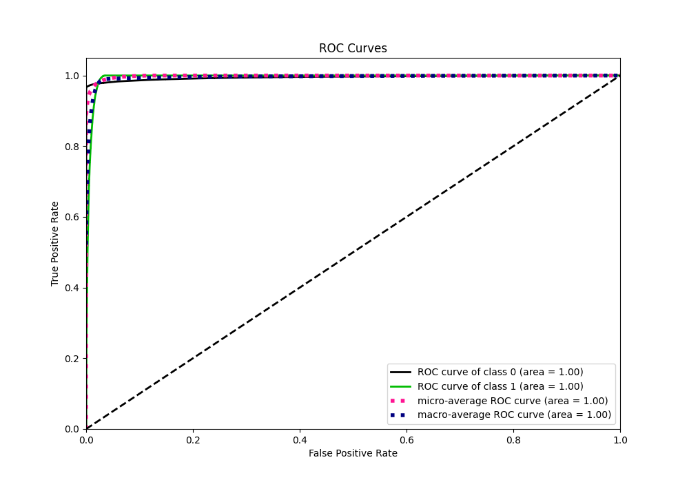

# Summary of 3_Default_LightGBM

[<< Go back](../README.md)

## LightGBM
- **n_jobs**: -1
- **objective**: binary
- **num_leaves**: 63
- **learning_rate**: 0.05
- **feature_fraction**: 0.9
- **bagging_fraction**: 0.9
- **min_data_in_leaf**: 10
- **metric**: binary_logloss
- **custom_eval_metric_name**: None
- **explain_level**: 2

## Validation
 - **validation_type**: split
 - **train_ratio**: 0.75
 - **shuffle**: True
 - **stratify**: True

## Optimized metric
logloss

## Training time

63.2 seconds

## Metric details
|           |     score |     threshold |
|:----------|----------:|--------------:|
| logloss   | 0.0483422 | nan           |
| auc       | 0.995019  | nan           |
| f1        | 0.892774  |   0.394149    |
| accuracy  | 0.978721  |   0.560821    |
| precision | 0.994292  |   0.972864    |
| recall    | 1         |   2.99445e-08 |
| mcc       | 0.88391   |   0.394149    |

## Metric details with threshold from accuracy metric
|           |     score |   threshold |
|:----------|----------:|------------:|
| logloss   | 0.0483422 |  nan        |
| auc       | 0.995019  |  nan        |
| f1        | 0.890501  |    0.560821 |
| accuracy  | 0.978721  |    0.560821 |
| precision | 0.86494   |    0.560821 |
| recall    | 0.917619  |    0.560821 |
| mcc       | 0.879199  |    0.560821 |

## Confusion matrix (at threshold=0.560821)
|              |   Predicted as 0 |   Predicted as 1 |
|:-------------|-----------------:|-----------------:|
| Labeled as 0 |           233498 |             3536 |
| Labeled as 1 |             2033 |            22645 |

## Learning curves

## Confusion Matrix

## Normalized Confusion Matrix

## ROC Curve

## Kolmogorov-Smirnov Statistic

## Precision-Recall Curve

## Calibration Curve

## Cumulative Gains Curve

## Lift Curve

## SHAP Importance

## SHAP Dependence plots

### Dependence (Fold 1)

## SHAP Decision plots

### Top-10 Worst decisions for class 0 (Fold 1)

### Top-10 Best decisions for class 0 (Fold 1)

### Top-10 Worst decisions for class 1 (Fold 1)

### Top-10 Best decisions for class 1 (Fold 1)

[<< Go back](../README.md)
