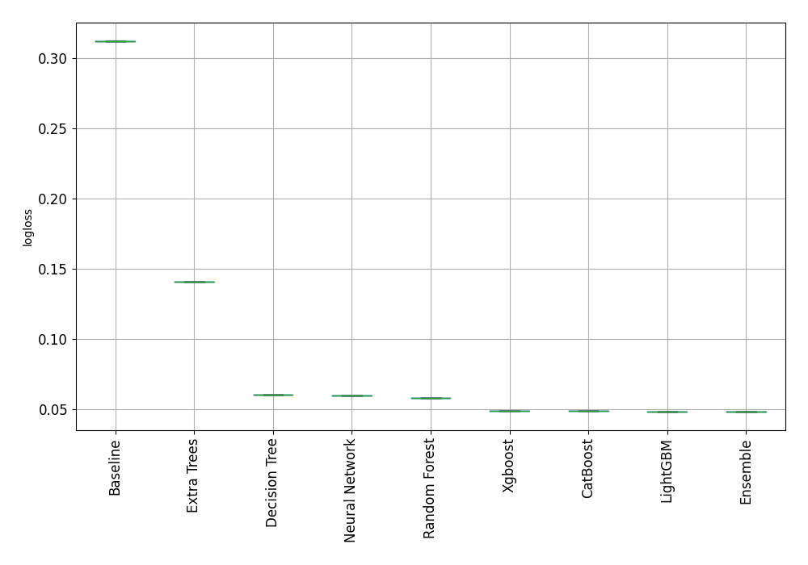
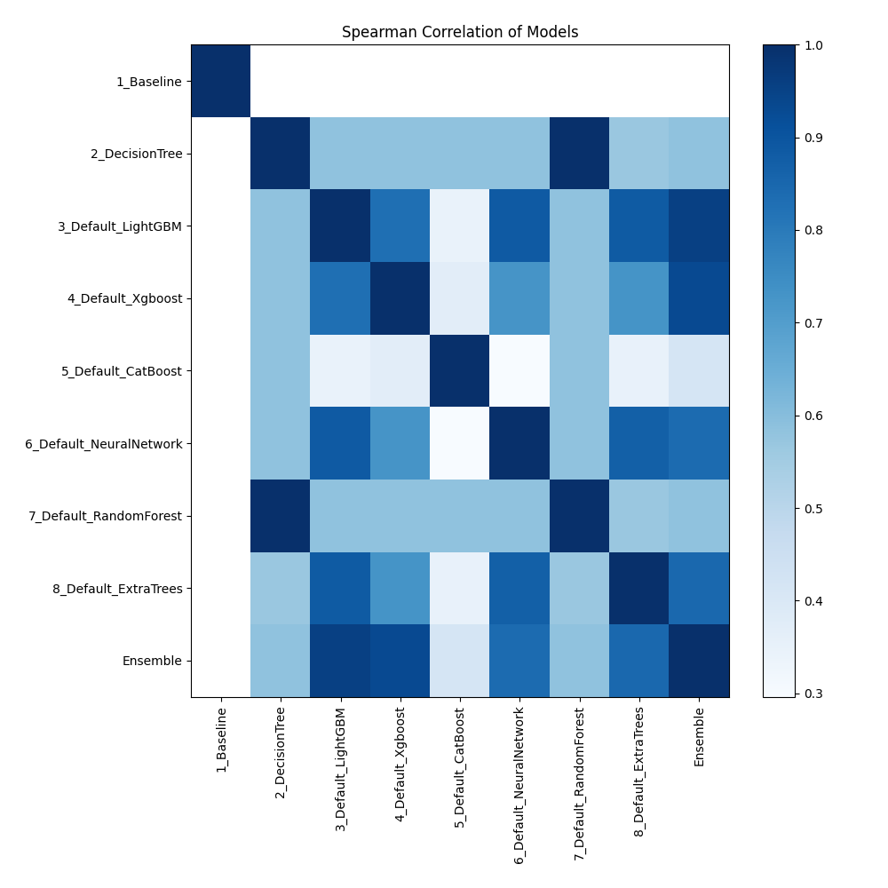

# Leaderboard

The given folder contains the inital test that was done to determine the feature importance using different machine learning model architectures. These results were later on used to create more comprehensive stacked ensemble machine learning model for better training and prediction.
Here the training set was divided into 75-25% split and validation was performed using the 25% split.

| Best model   | name                                                         | model_type     | metric_type   |   metric_value |   train_time |
|:-------------|:-------------------------------------------------------------|:---------------|:--------------|---------------:|-------------:|
|              | [1_Baseline](1_Baseline/README.md)                           | Baseline       | logloss       |      0.312357  |         2.53 |
|              | [2_DecisionTree](2_DecisionTree/README.md)                   | Decision Tree  | logloss       |      0.0603283 |        67.45 |
|              | [3_Default_LightGBM](3_Default_LightGBM/README.md)           | LightGBM       | logloss       |      0.0485162 |        38.38 |
|              | [4_Default_Xgboost](4_Default_Xgboost/README.md)             | Xgboost        | logloss       |      0.0488005 |        48.12 |
|              | [5_Default_CatBoost](5_Default_CatBoost/README.md)           | CatBoost       | logloss       |      0.0487352 |        66.68 |
|              | [6_Default_NeuralNetwork](6_Default_NeuralNetwork/README.md) | Neural Network | logloss       |      0.0597048 |        94.13 |
|              | [7_Default_RandomForest](7_Default_RandomForest/README.md)   | Random Forest  | logloss       |      0.0578332 |        90.14 |
|              | [8_Default_ExtraTrees](8_Default_ExtraTrees/README.md)       | Extra Trees    | logloss       |      0.140991  |        80.97 |
| **the best** | [Ensemble](Ensemble/README.md)                               | Ensemble       | logloss       |      0.0483875 |        19.98 |

### Performance

### Performance Boxplot

### Spearman Correlation of Models

