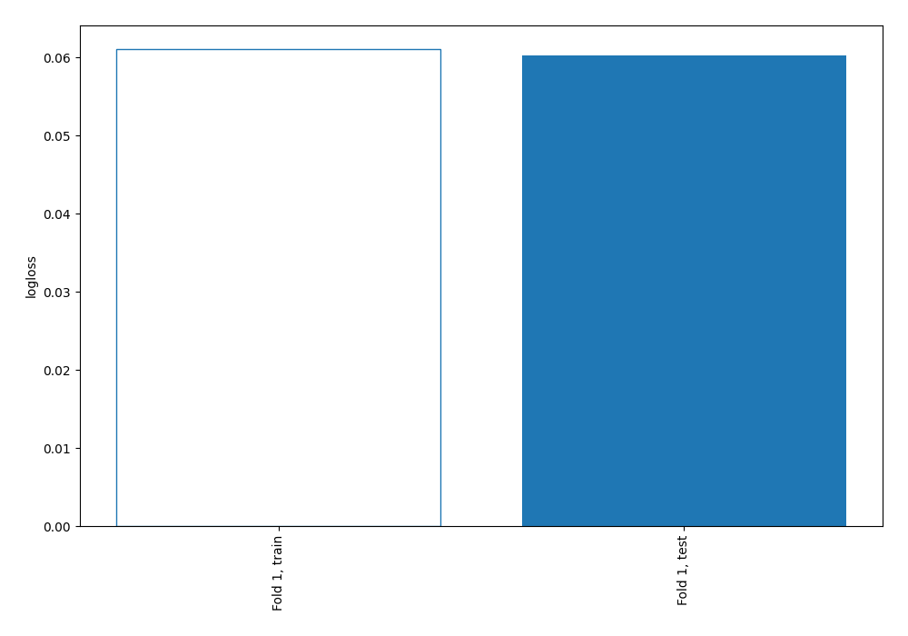
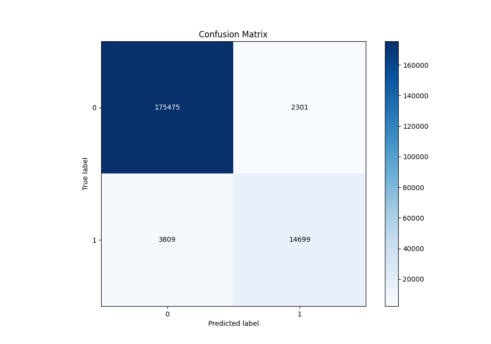
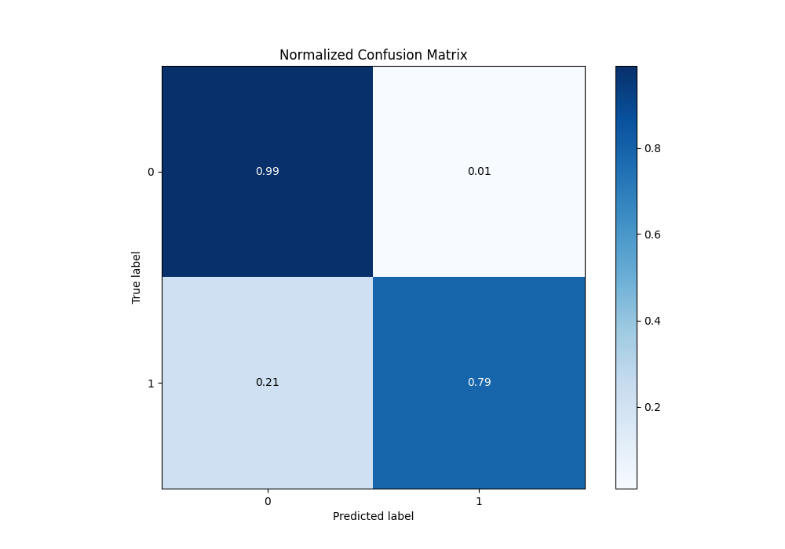
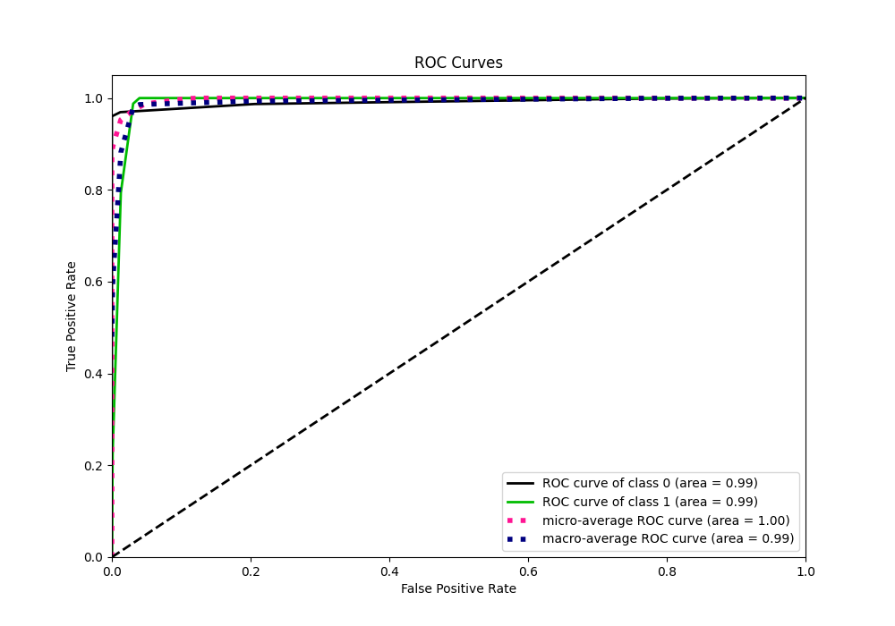
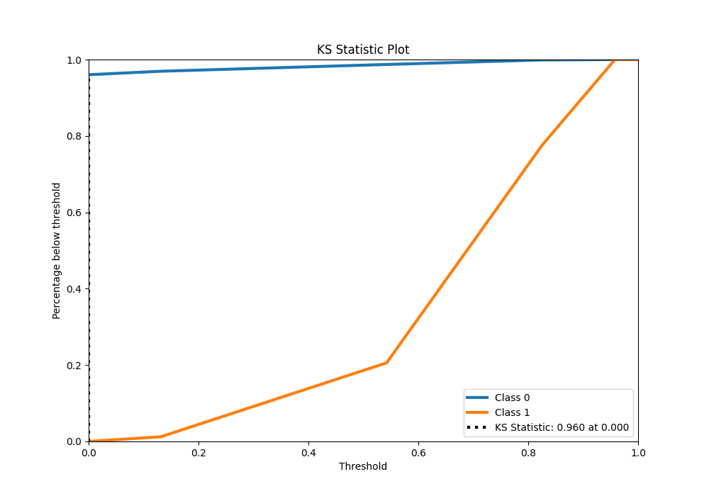
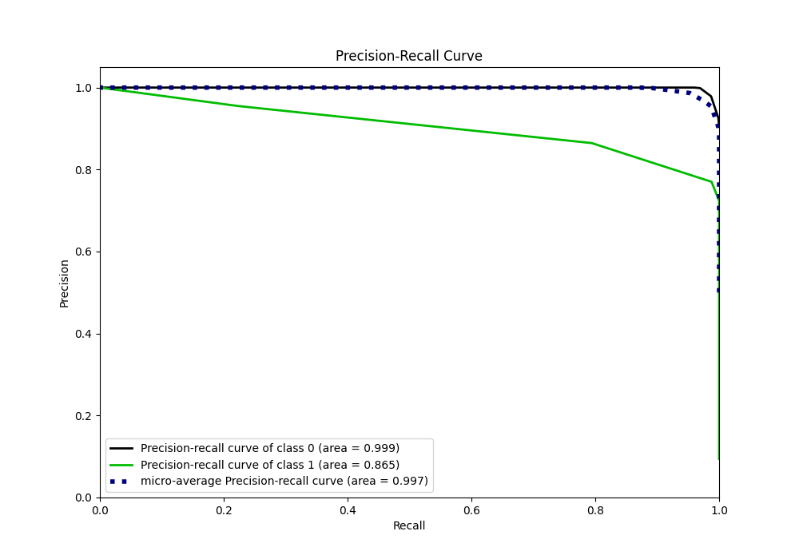
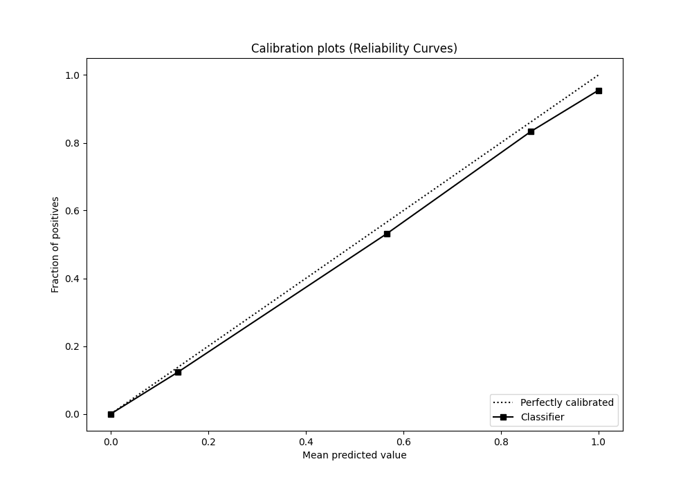
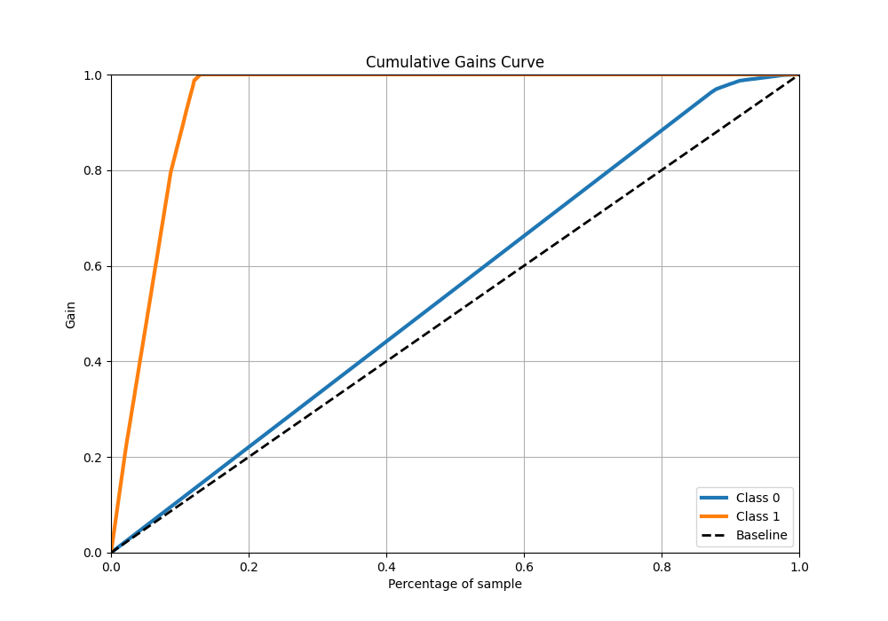
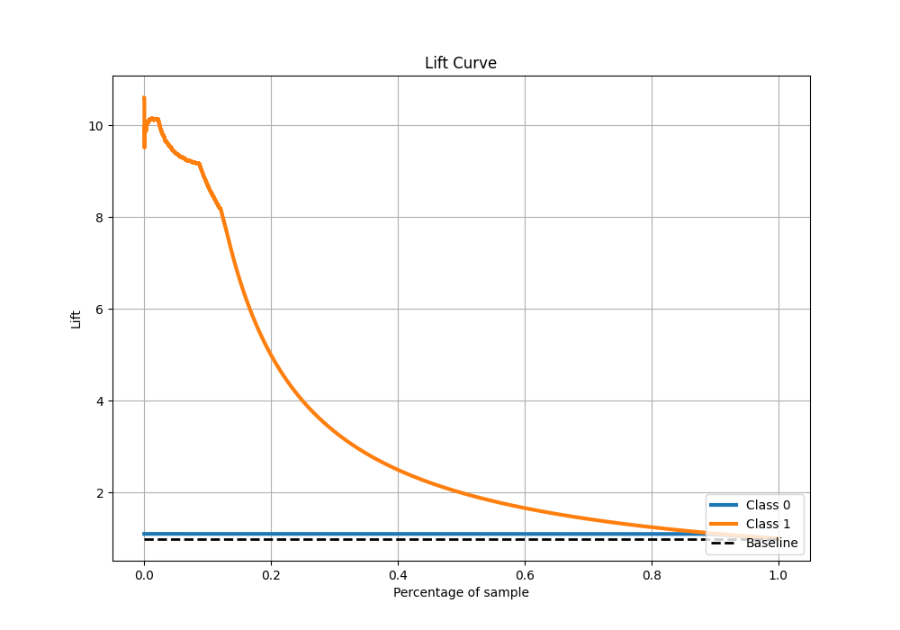

# Summary of 2_DecisionTree

[<< Go back](../README.md)

## Decision Tree
- **n_jobs**: -1
- **criterion**: gini
- **max_depth**: 3
- **explain_level**: 2

## Validation
 - **validation_type**: split
 - **train_ratio**: 0.75
 - **shuffle**: True
 - **stratify**: True

## Optimized metric
logloss

## Training time

66.7 seconds

## Metric details
|           |     score |   threshold |
|:----------|----------:|------------:|
| logloss   | 0.0603283 |  nan        |
| auc       | 0.99122   |  nan        |
| f1        | 0.839613  |    0        |
| accuracy  | 0.968872  |    0.542255 |
| precision | 0.95488   |    0.825455 |
| recall    | 1         |    0        |
| mcc       | 0.833536  |    0        |

## Metric details with threshold from accuracy metric
|           |     score |   threshold |
|:----------|----------:|------------:|
| logloss   | 0.0603283 |  nan        |
| auc       | 0.99122   |  nan        |
| f1        | 0.827926  |    0.542255 |
| accuracy  | 0.968872  |    0.542255 |
| precision | 0.864647  |    0.542255 |
| recall    | 0.794197  |    0.542255 |
| mcc       | 0.811733  |    0.542255 |

## Confusion matrix (at threshold=0.542255)
|              |   Predicted as 0 |   Predicted as 1 |
|:-------------|-----------------:|-----------------:|
| Labeled as 0 |           175475 |             2301 |
| Labeled as 1 |             3809 |            14699 |

## Learning curves

## Confusion Matrix

## Normalized Confusion Matrix

## ROC Curve

## Kolmogorov-Smirnov Statistic

## Precision-Recall Curve

## Calibration Curve

## Cumulative Gains Curve

## Lift Curve

[<< Go back](../README.md)
