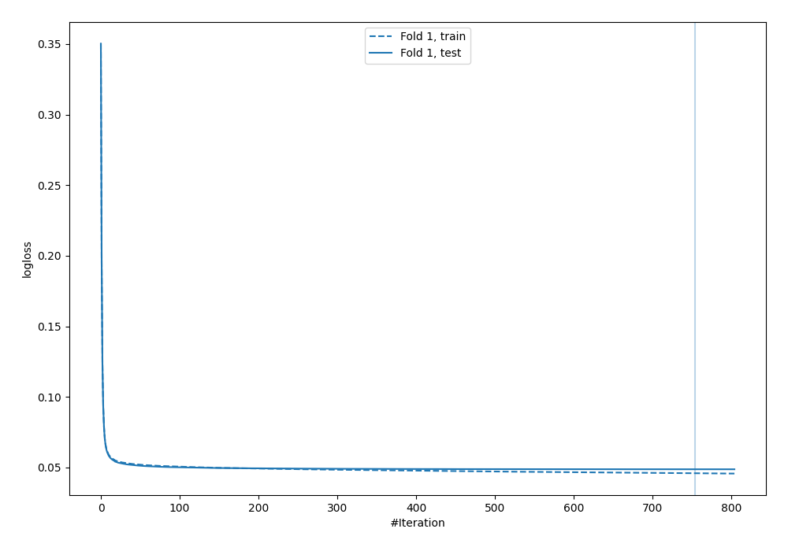
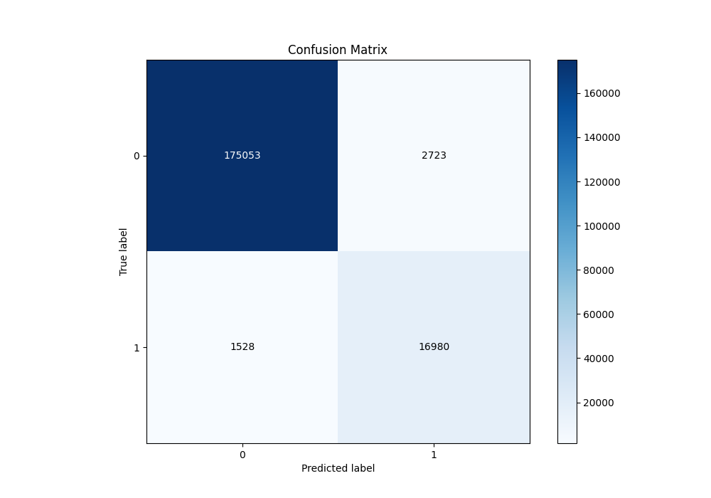
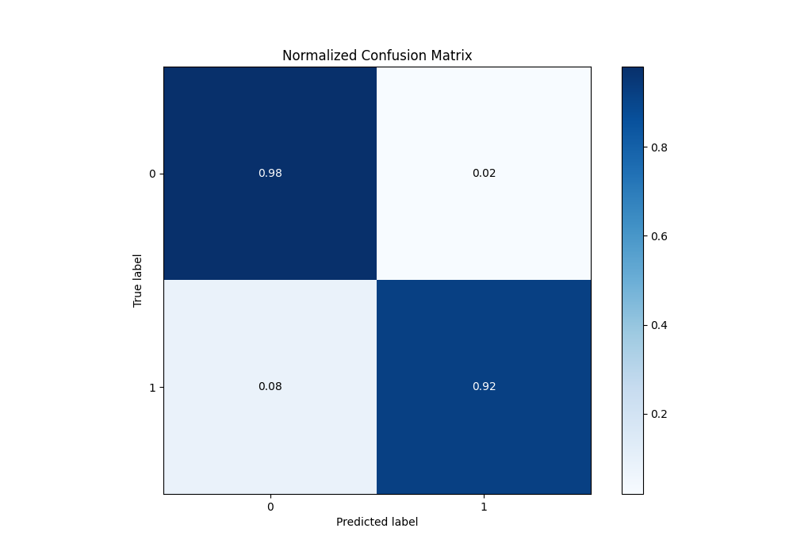
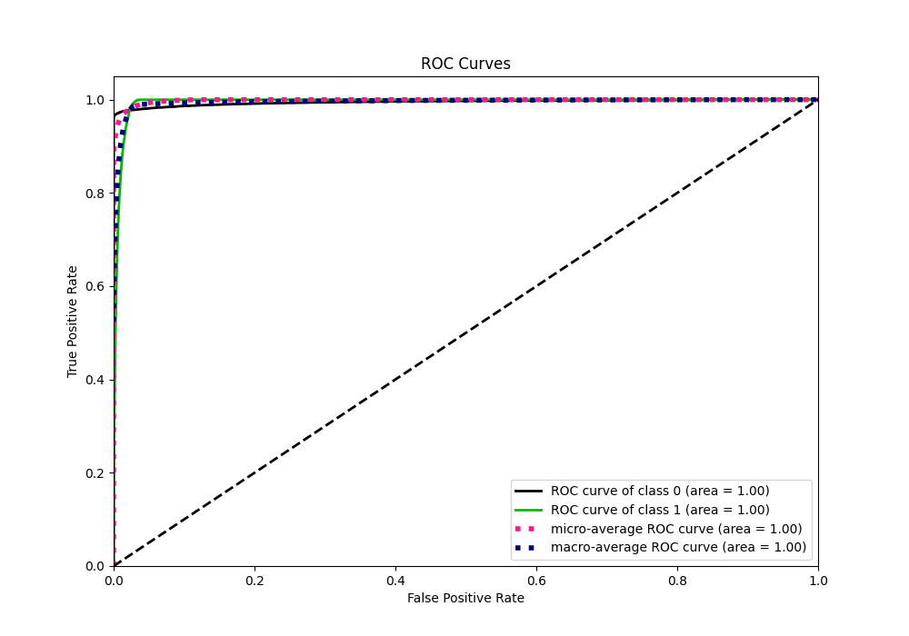
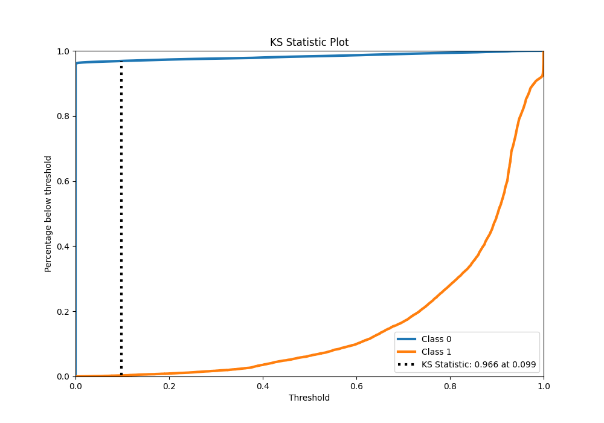
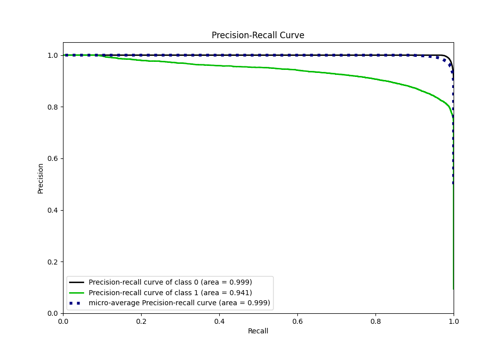
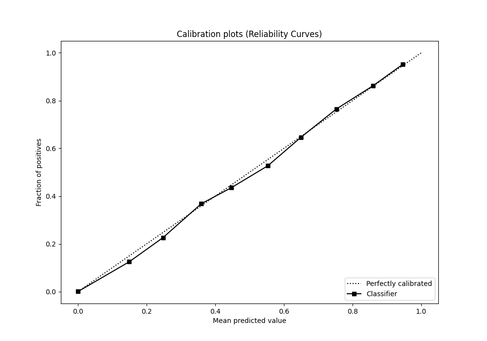
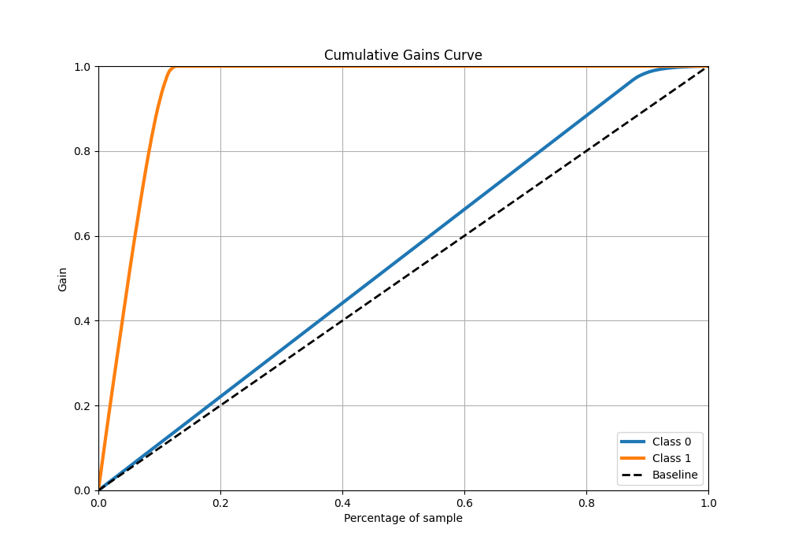
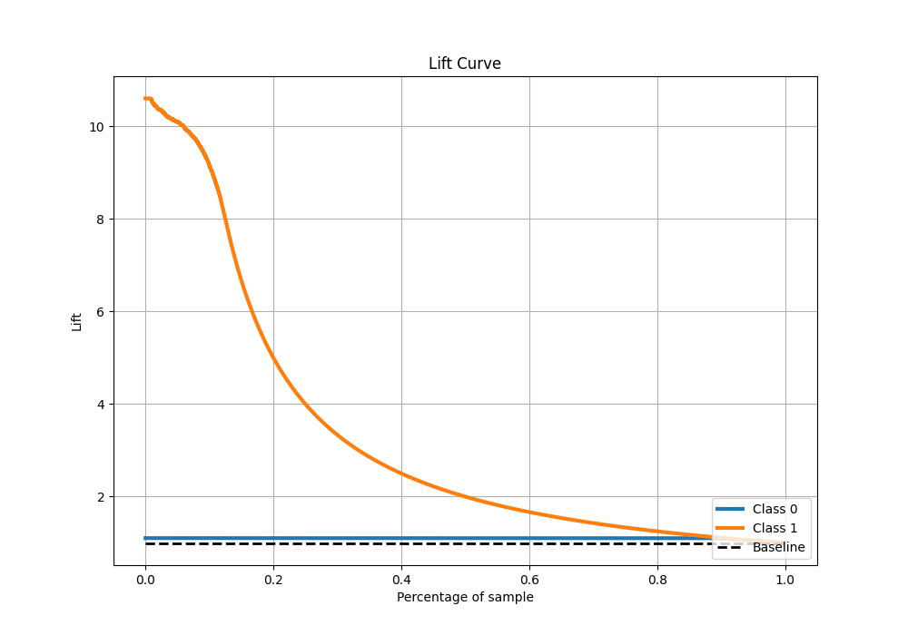

# Summary of 5_Default_CatBoost

[<< Go back](../README.md)

## CatBoost
- **n_jobs**: -1
- **learning_rate**: 0.1
- **depth**: 6
- **rsm**: 1
- **loss_function**: Logloss
- **eval_metric**: Logloss
- **explain_level**: 2

## Validation
 - **validation_type**: split
 - **train_ratio**: 0.75
 - **shuffle**: True
 - **stratify**: True

## Optimized metric
logloss

## Training time

65.6 seconds

## Metric details
|           |     score |     threshold |
|:----------|----------:|--------------:|
| logloss   | 0.0487352 | nan           |
| auc       | 0.995003  | nan           |
| f1        | 0.890598  |   0.392188    |
| accuracy  | 0.978343  |   0.555679    |
| precision | 0.992665  |   0.974645    |
| recall    | 1         |   2.27163e-09 |
| mcc       | 0.881592  |   0.392188    |

## Metric details with threshold from accuracy metric
|           |     score |   threshold |
|:----------|----------:|------------:|
| logloss   | 0.0487352 |  nan        |
| auc       | 0.995003  |  nan        |
| f1        | 0.888749  |    0.555679 |
| accuracy  | 0.978343  |    0.555679 |
| precision | 0.861798  |    0.555679 |
| recall    | 0.917441  |    0.555679 |
| mcc       | 0.877293  |    0.555679 |

## Confusion matrix (at threshold=0.555679)
|              |   Predicted as 0 |   Predicted as 1 |
|:-------------|-----------------:|-----------------:|
| Labeled as 0 |           175053 |             2723 |
| Labeled as 1 |             1528 |            16980 |

## Learning curves

## Confusion Matrix

## Normalized Confusion Matrix

## ROC Curve

## Kolmogorov-Smirnov Statistic

## Precision-Recall Curve

## Calibration Curve

## Cumulative Gains Curve

## Lift Curve

[<< Go back](../README.md)
