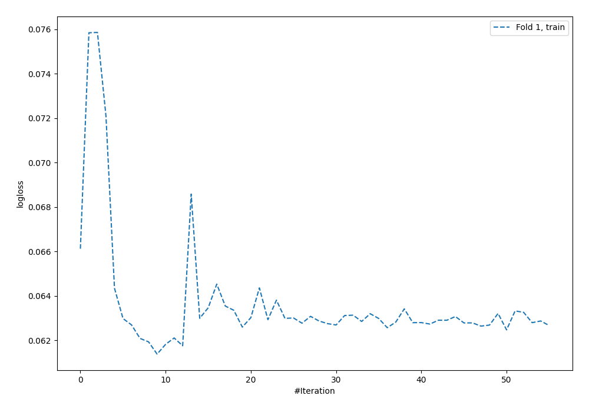
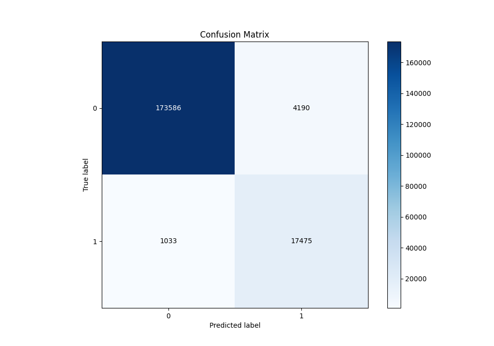
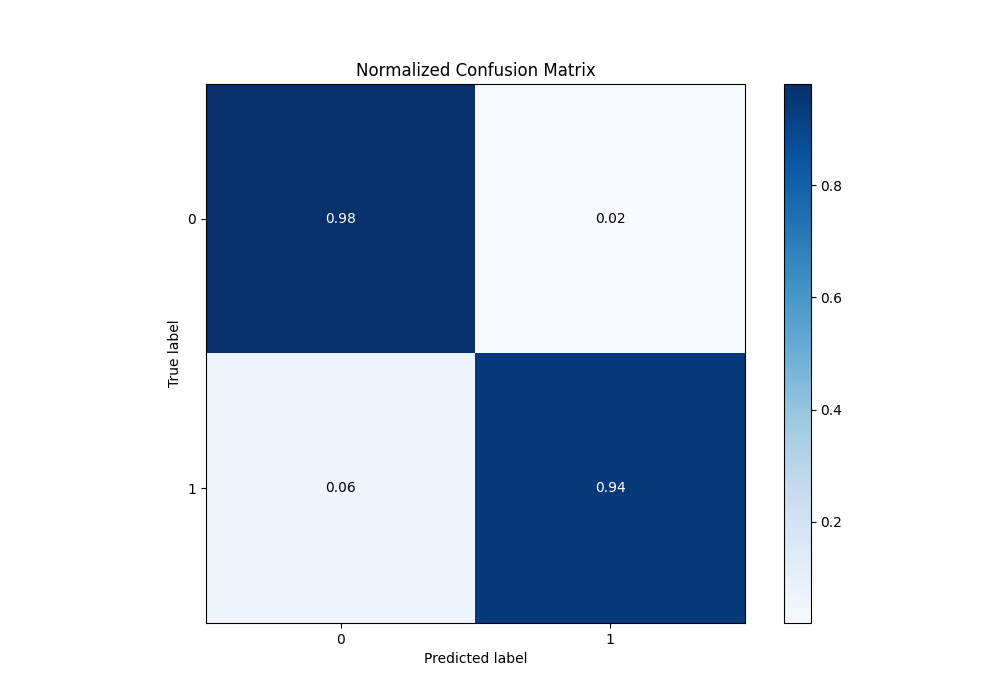
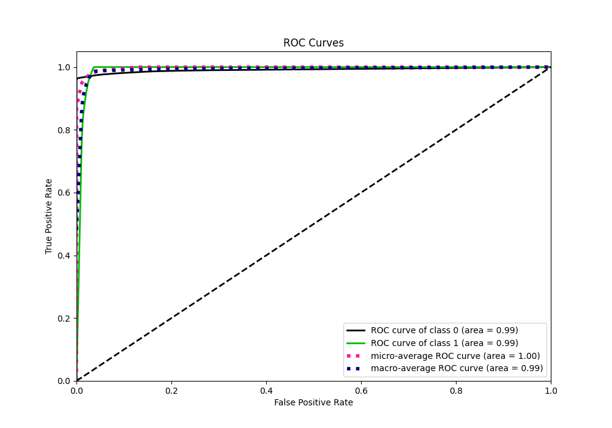
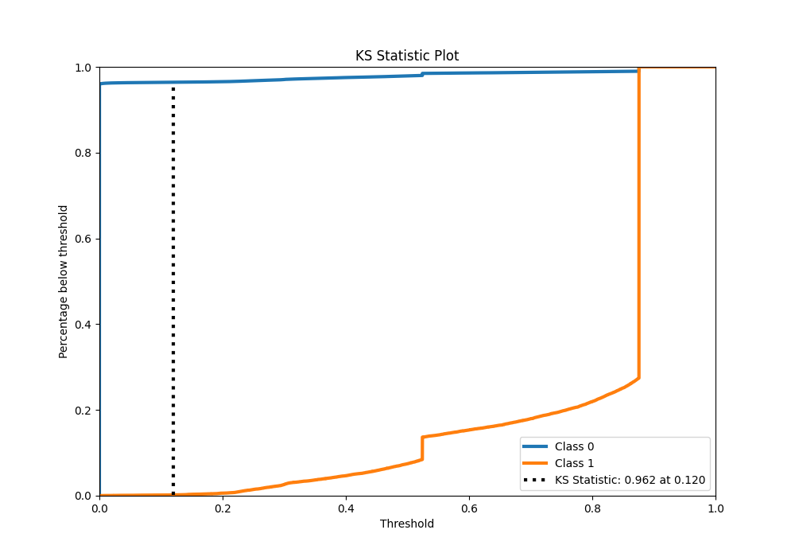
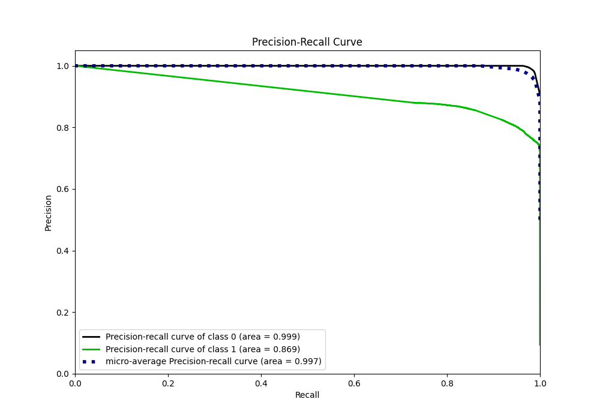
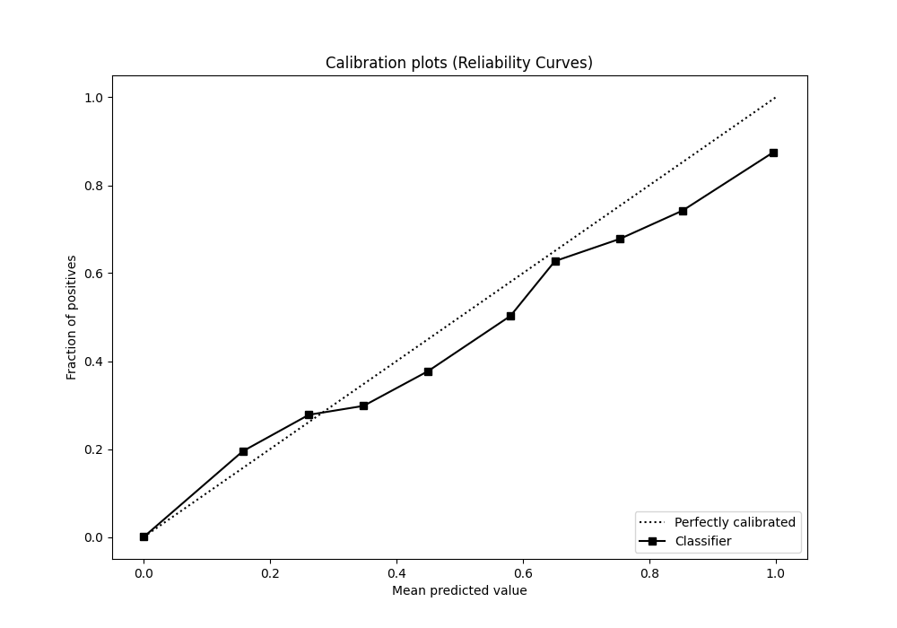
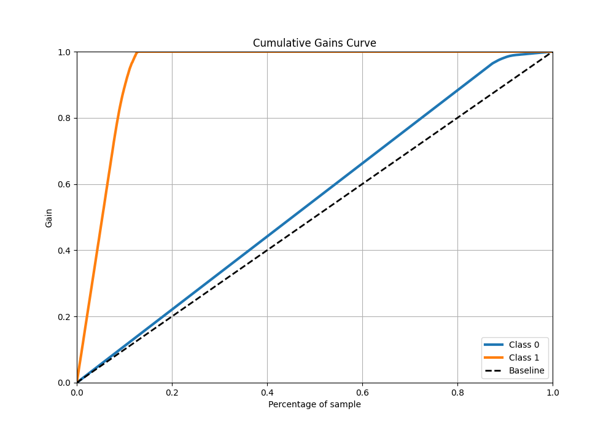
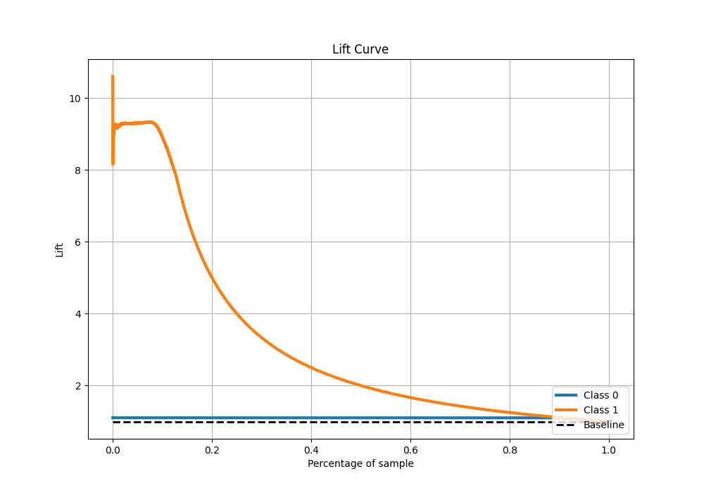

# Summary of 6_Default_NeuralNetwork

[<< Go back](../README.md)

## Neural Network
- **n_jobs**: -1
- **dense_1_size**: 32
- **dense_2_size**: 16
- **learning_rate**: 0.05
- **explain_level**: 2

## Validation
 - **validation_type**: split
 - **train_ratio**: 0.75
 - **shuffle**: True
 - **stratify**: True

## Optimized metric
logloss

## Training time

93.1 seconds

## Metric details
|           |     score |   threshold |
|:----------|----------:|------------:|
| logloss   | 0.0597048 |  nan        |
| auc       | 0.991411  |  nan        |
| f1        | 0.869987  |    0.439809 |
| accuracy  | 0.973391  |    0.439809 |
| precision | 0.8787    |    0.849362 |
| recall    | 1         |    0        |
| mcc       | 0.858559  |    0.439809 |

## Metric details with threshold from accuracy metric
|           |     score |   threshold |
|:----------|----------:|------------:|
| logloss   | 0.0597048 |  nan        |
| auc       | 0.991411  |  nan        |
| f1        | 0.869987  |    0.439809 |
| accuracy  | 0.973391  |    0.439809 |
| precision | 0.806601  |    0.439809 |
| recall    | 0.944186  |    0.439809 |
| mcc       | 0.858559  |    0.439809 |

## Confusion matrix (at threshold=0.439809)
|              |   Predicted as 0 |   Predicted as 1 |
|:-------------|-----------------:|-----------------:|
| Labeled as 0 |           173586 |             4190 |
| Labeled as 1 |             1033 |            17475 |

## Learning curves

## Confusion Matrix

## Normalized Confusion Matrix

## ROC Curve

## Kolmogorov-Smirnov Statistic

## Precision-Recall Curve

## Calibration Curve

## Cumulative Gains Curve

## Lift Curve

[<< Go back](../README.md)
