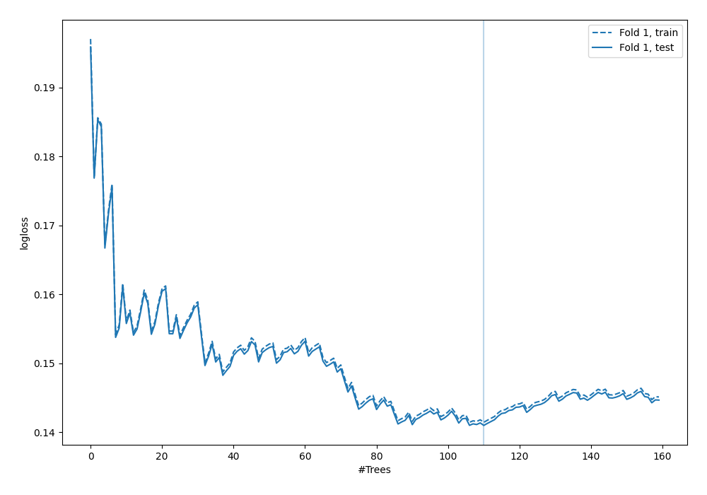
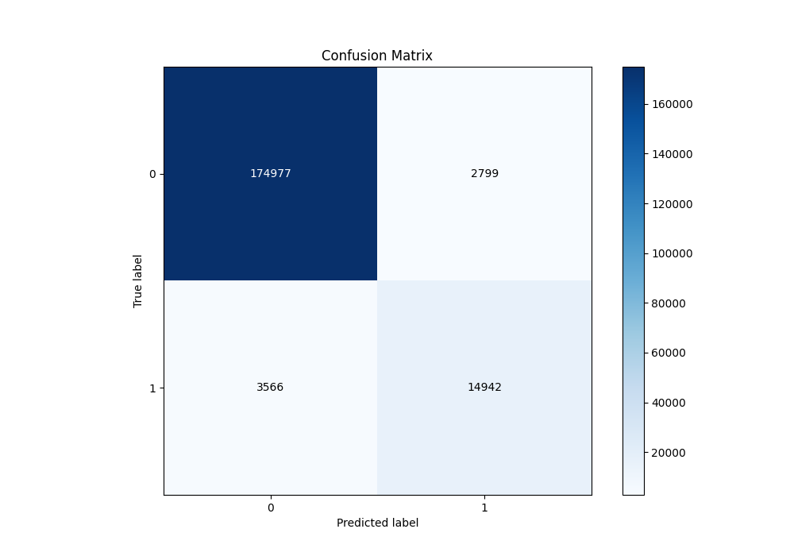
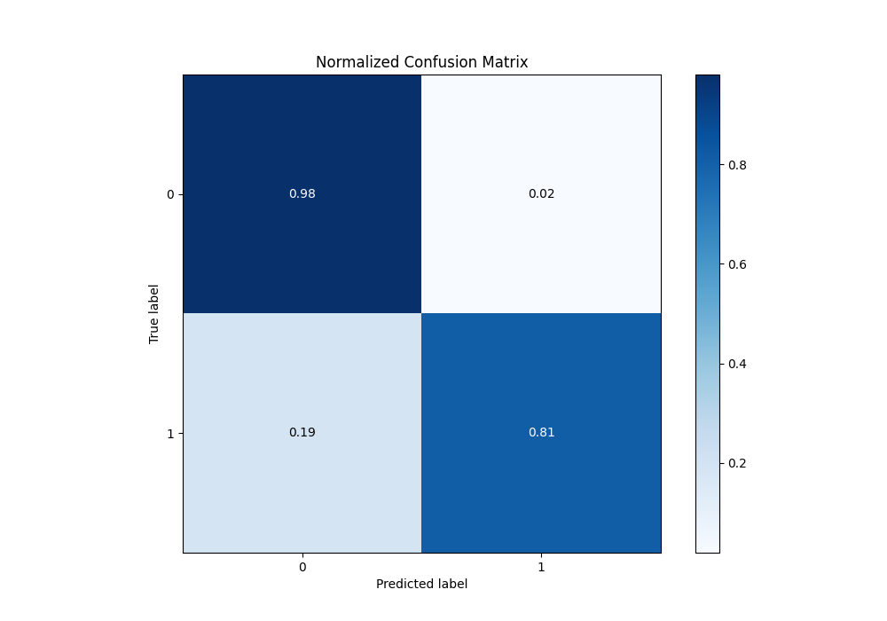
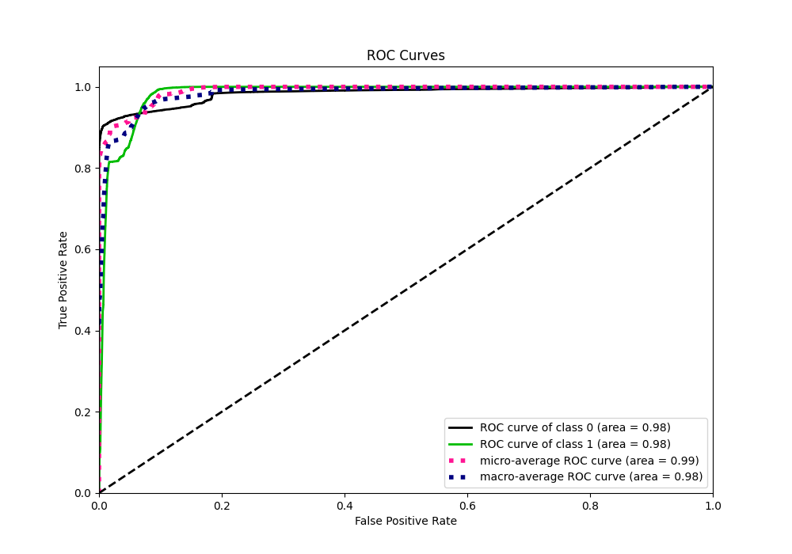
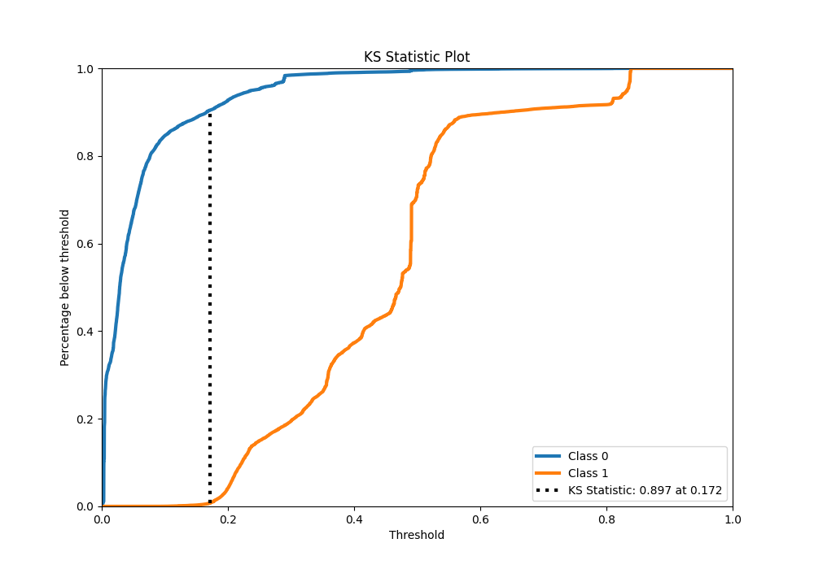
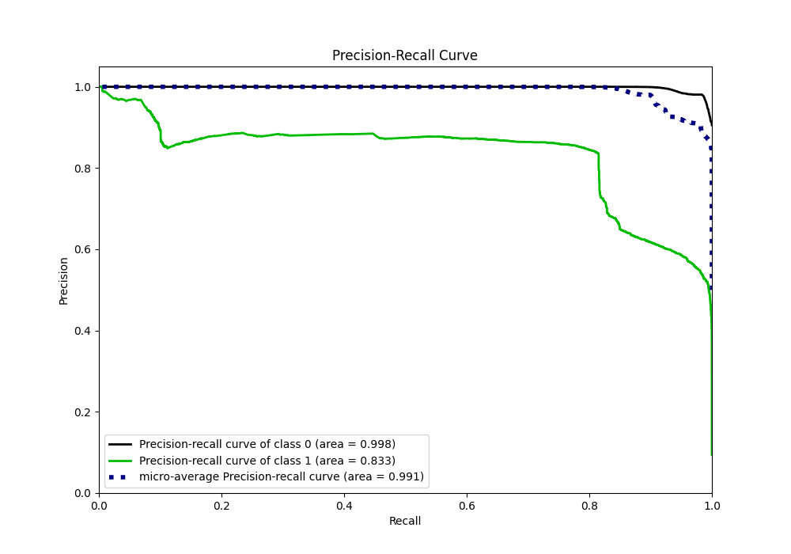
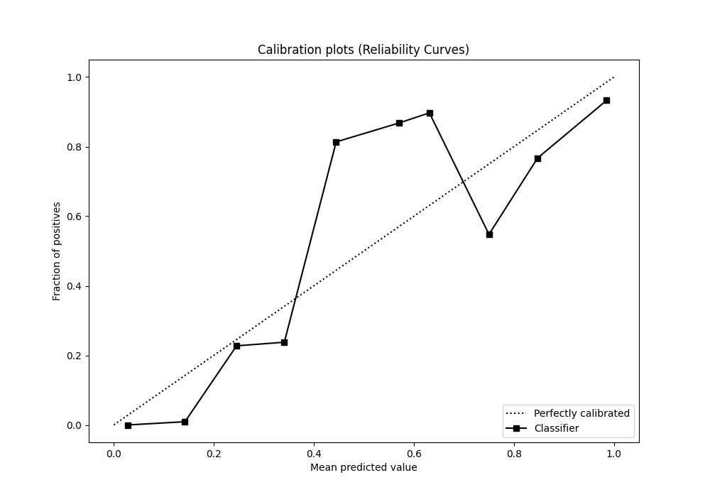
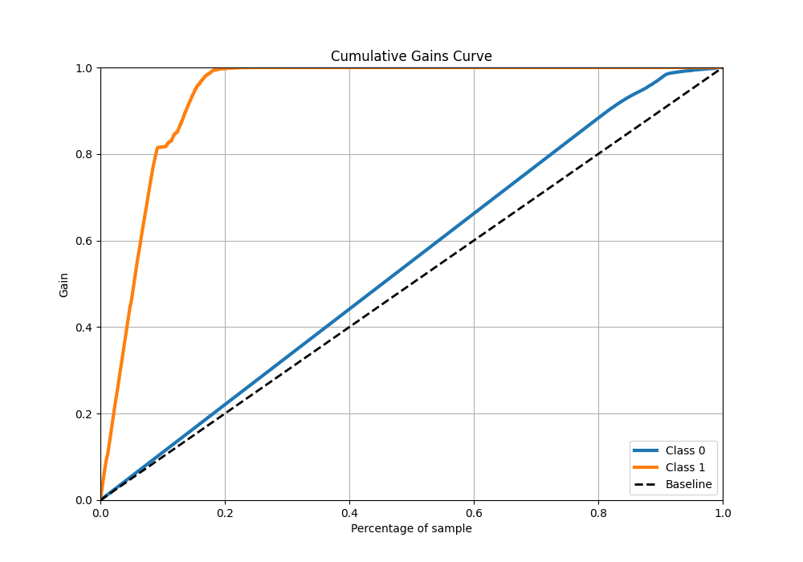
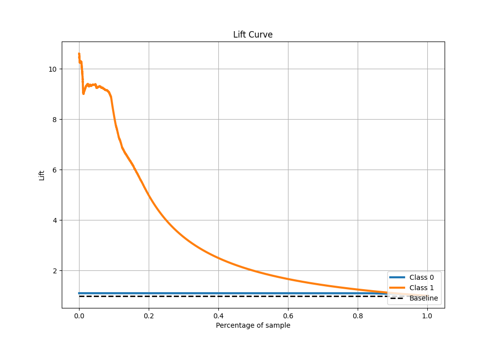

# Summary of 8_Default_ExtraTrees

[<< Go back](../README.md)

## Extra Trees Classifier (Extra Trees)
- **n_jobs**: -1
- **criterion**: gini
- **max_features**: 0.9
- **min_samples_split**: 30
- **max_depth**: 4
- **eval_metric_name**: logloss
- **explain_level**: 2

## Validation
 - **validation_type**: split
 - **train_ratio**: 0.75
 - **shuffle**: True
 - **stratify**: True

## Optimized metric
logloss

## Training time

80.1 seconds

## Metric details
|           |    score |    threshold |
|:----------|---------:|-------------:|
| logloss   | 0.140991 | nan          |
| auc       | 0.983437 | nan          |
| f1        | 0.824409 |   0.298478   |
| accuracy  | 0.967572 |   0.298478   |
| precision | 0.896333 |   0.644532   |
| recall    | 1        |   0.00276378 |
| mcc       | 0.806774 |   0.298478   |

## Metric details with threshold from accuracy metric
|           |    score |   threshold |
|:----------|---------:|------------:|
| logloss   | 0.140991 |  nan        |
| auc       | 0.983437 |  nan        |
| f1        | 0.824409 |    0.298478 |
| accuracy  | 0.967572 |    0.298478 |
| precision | 0.84223  |    0.298478 |
| recall    | 0.807327 |    0.298478 |
| mcc       | 0.806774 |    0.298478 |

## Confusion matrix (at threshold=0.298478)
|              |   Predicted as 0 |   Predicted as 1 |
|:-------------|-----------------:|-----------------:|
| Labeled as 0 |           174977 |             2799 |
| Labeled as 1 |             3566 |            14942 |

## Learning curves

## Confusion Matrix

## Normalized Confusion Matrix

## ROC Curve

## Kolmogorov-Smirnov Statistic

## Precision-Recall Curve

## Calibration Curve

## Cumulative Gains Curve

## Lift Curve

[<< Go back](../README.md)
