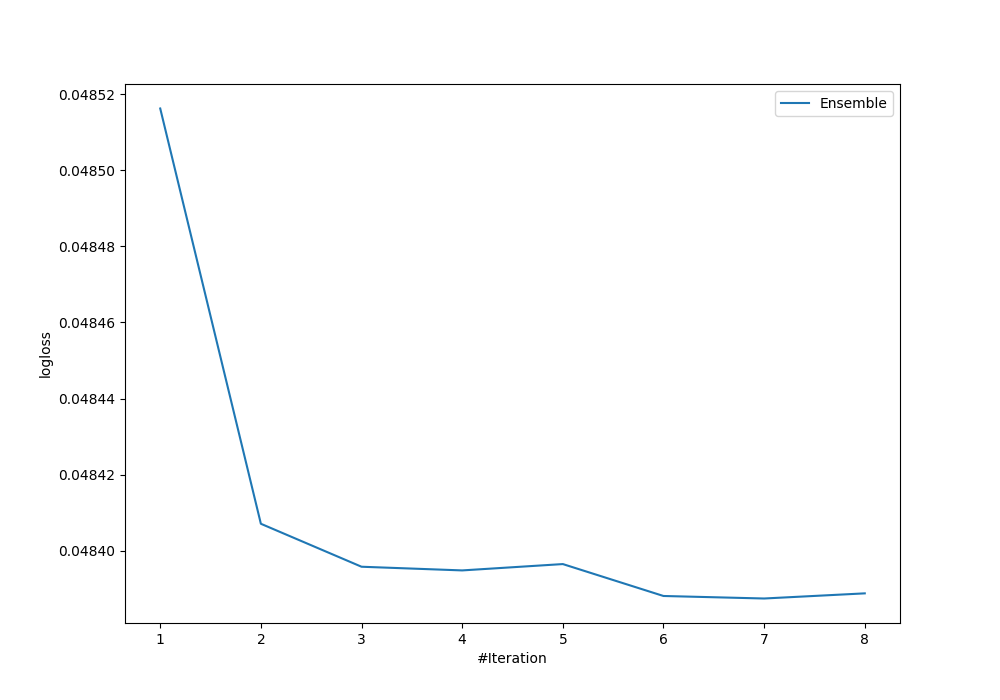
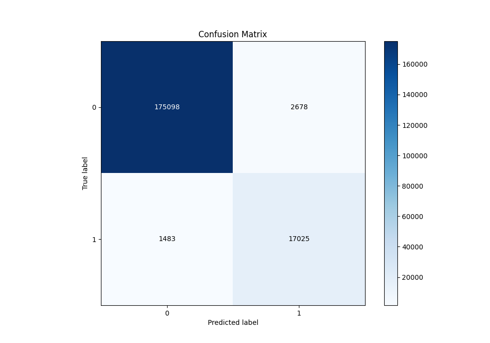
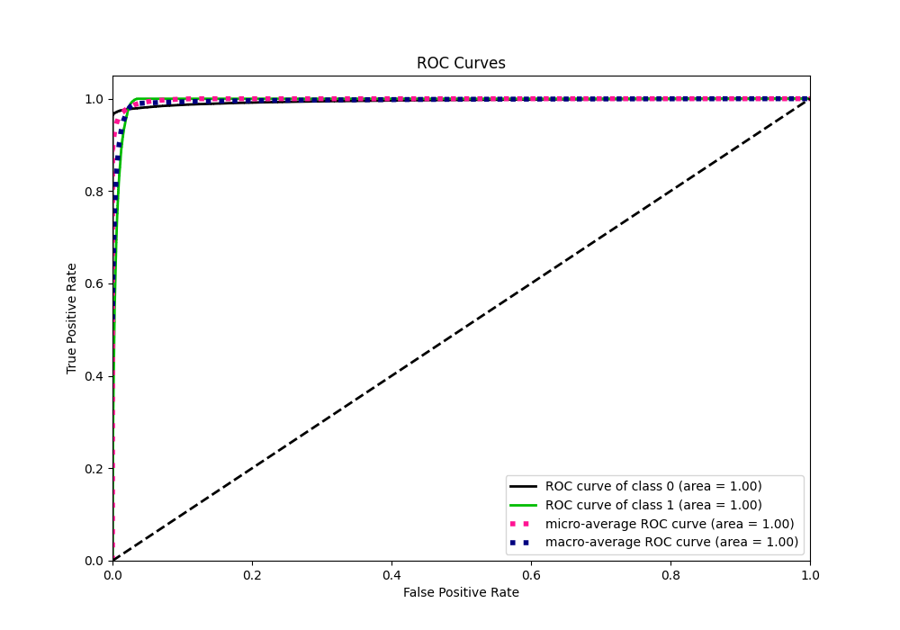
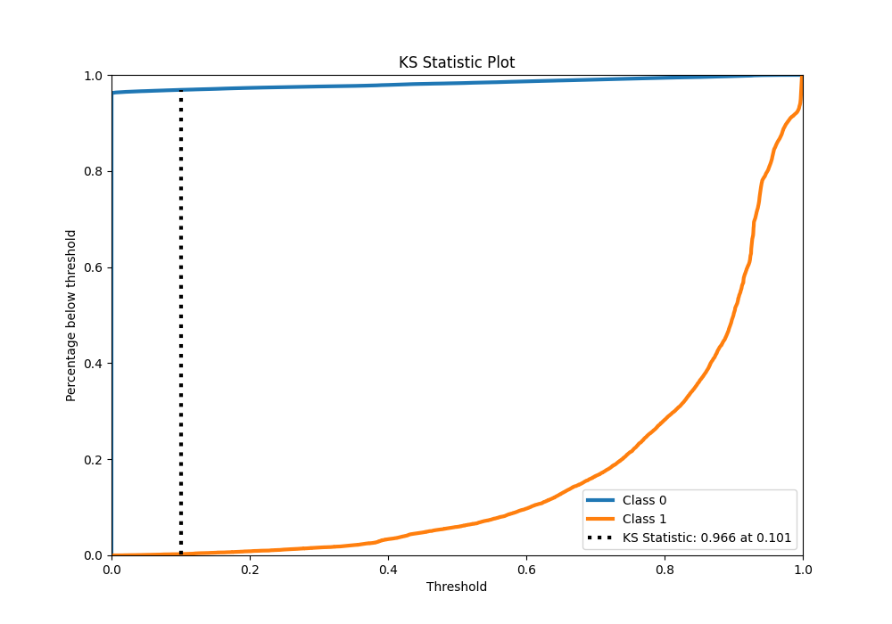
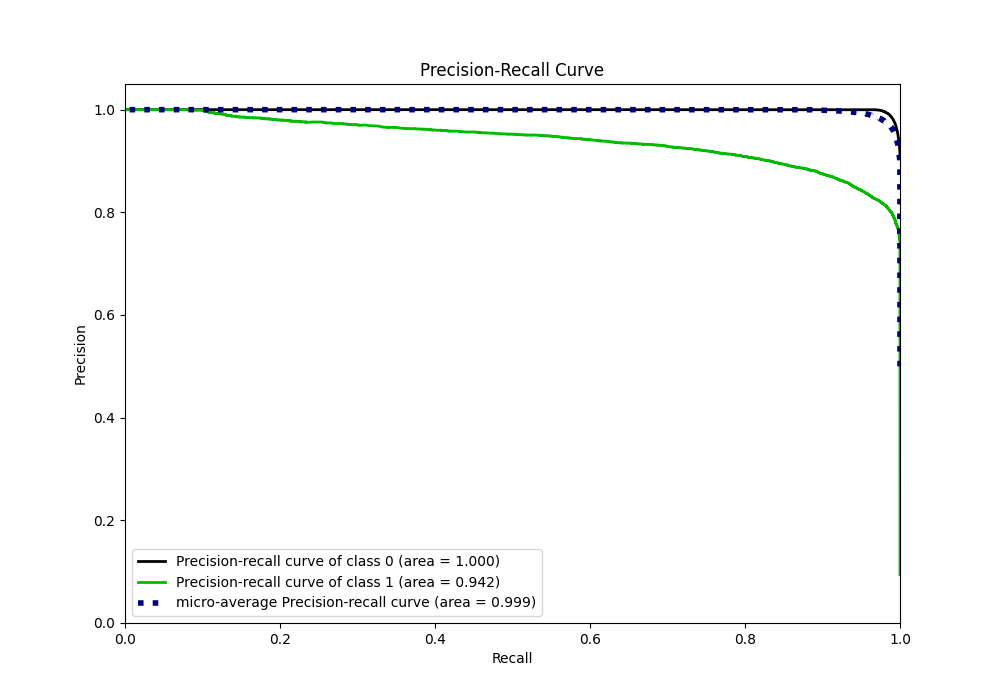
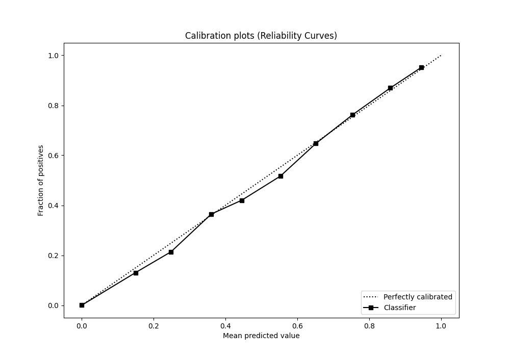
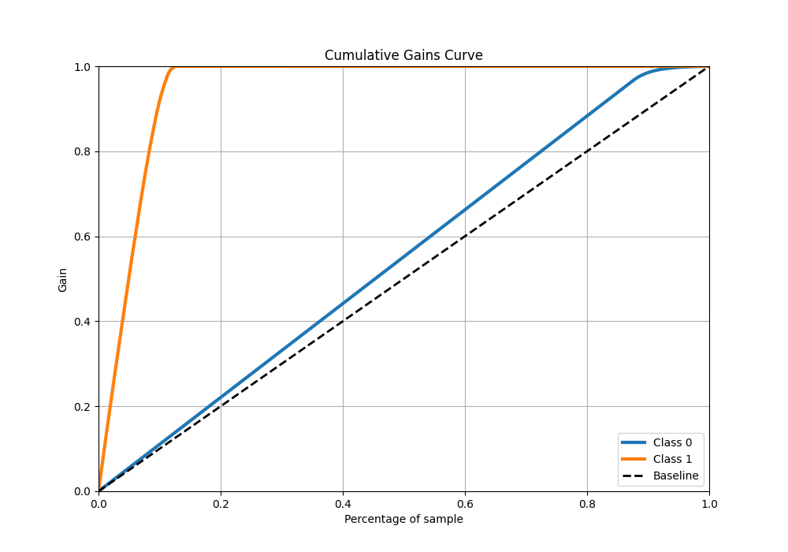
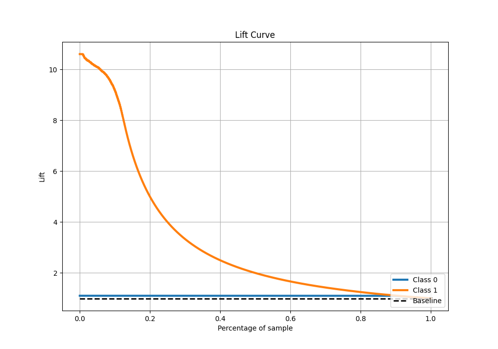

# Summary of Ensemble

[<< Go back](../README.md)

## Ensemble structure
| Model              |   Weight |
|:-------------------|---------:|
| 3_Default_LightGBM |        4 |
| 4_Default_Xgboost  |        1 |
| 5_Default_CatBoost |        2 |

## Metric details
|           |     score |    threshold |
|:----------|----------:|-------------:|
| logloss   | 0.0483875 | nan          |
| auc       | 0.995077  | nan          |
| f1        | 0.891544  |   0.395443   |
| accuracy  | 0.978801  |   0.563168   |
| precision | 0.994621  |   0.972979   |
| recall    | 1         |   1.6238e-07 |
| mcc       | 0.882649  |   0.395443   |

## Metric details with threshold from accuracy metric
|           |     score |   threshold |
|:----------|----------:|------------:|
| logloss   | 0.0483875 |  nan        |
| auc       | 0.995077  |  nan        |
| f1        | 0.891105  |    0.563168 |
| accuracy  | 0.978801  |    0.563168 |
| precision | 0.864082  |    0.563168 |
| recall    | 0.919872  |    0.563168 |
| mcc       | 0.879903  |    0.563168 |

## Confusion matrix (at threshold=0.563168)
|              |   Predicted as 0 |   Predicted as 1 |
|:-------------|-----------------:|-----------------:|
| Labeled as 0 |           175098 |             2678 |
| Labeled as 1 |             1483 |            17025 |

## Learning curves

## Confusion Matrix

## Normalized Confusion Matrix

## ROC Curve

## Kolmogorov-Smirnov Statistic

## Precision-Recall Curve

## Calibration Curve

## Cumulative Gains Curve

## Lift Curve

[<< Go back](../README.md)
